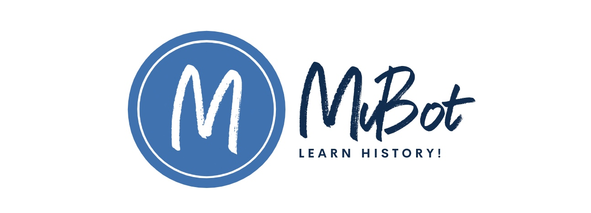

# RAG implementation of LLMs (OpenAI) by using Python-Flask, Haystack & React.



## About this package

This new solution will expose a controlled platform for an end-end LLMs that feed source data with RAG implementation. I'll also use OpenAI python-based SDK and Haystack embeddings in this case. This application developed using Flask, openai & the front-end developed using React. This project is for the advanced Python developer & Data Science Newbi's.


## How to use this package

(The following instructions apply to Posix/bash. Windows users should check
[here](https://docs.python.org/3/library/venv.html).)

First, clone this repository and open a terminal inside the root folder.

Create and activate a new virtual environment (recommended) by running
the following:

```bash
python3 -m venv venv
source venv/bin/activate
```

Install the requirements:

```bash
pip install -r requirements.txt
```

Run the Restricted-API:

```bash
python flaskServer.py
```

Note down the port number, which will be generated as output.

Run the Proxy:

```bash

To run the react app, you need to go to react app and need to fire the following -

```bash
npm start
```

It will generate the right url, which later can be used inside the react app -

```bash
Compiled successfully!

You can now view my-app in the browser.

  Local:            http://localhost:3001/
  On Your Network:  http://102.68.1.10:3001/

Note that the development build is not optimized.
To create a production build, use npm run build.
```

Please find the some of the important dependent package -

```
pip install farm-haystack==1.19.0
pip install Flask==2.2.5
pip install Flask-Cors==4.0.0
pip install Flask-JWT-Extended==4.5.2
pip install Flask-Session==0.5.0
pip install openai==0.27.8
pip install pandas==2.0.3
pip install tensorflow==2.11.1

```

Install the above requirements.

Note that the debug indicator is set to "Y". This will generate logs. If you change this to 'N'. No logs will be generated. However, the process will be faster.

## Screenshots


## Resources

- To view the complete demo with sound, check out our [YouTube Page](https://youtu.be/oLVxTjst3oE).
- To view on Python, check out the [Python Page](https://docs.python.org/3/).
- To view more on the OpenAI, check out this [OpenAI Official Page](https://platform.openai.com/examples).
- To view more on the Haystack, check out this [Haystack Official Page](https://docs.haystack.deepset.ai/docs).
- To view more on the React, check out this [React Official Page](https://react.dev/reference/react).
- For this use case, we've used this open-source brilliant website API, which provides a lot of information free. We've used this as source for education purpose only to demonstrate how one can feed the RAG context to your OpenAI source & get the quick, less-expensive & better response. To view more on the The Metropolitan Museum of Art Collection API, check out this [The Metropolitan Museum of Art Collection API Page](https://metmuseum.github.io/#objects). 
